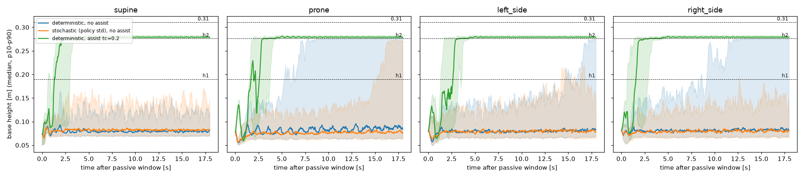
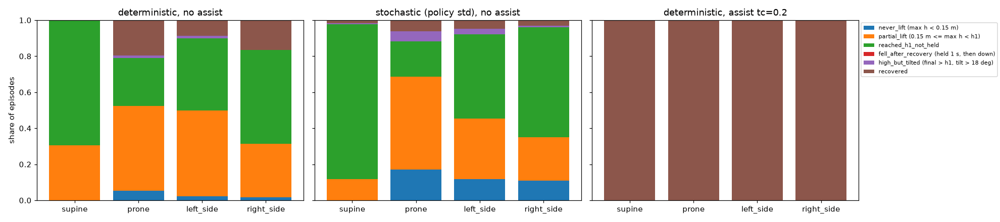
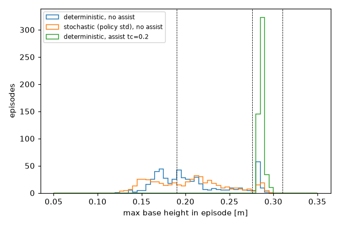

# model_2150 recovery evaluation (simulation)

- checkpoint: `/home/huy/minipi_getup/logs/rsl_rl/minipi_ftsr_ref/2026-10-07_21-53-02_ftsr_ref_recovery_v2/model_2150.pt`
- task `Mjlab-FTSR-Ref-MiniPi-Recovery-Stateless` (v2 stage semantics), H-conservative plant, student policy; 128 envs per pose, env seed 2150; same reset states in all modes (same env seed; qpos difference after the first physics step: median 0, max 2.4e-4; at the end of the 2 s passive window base height differs by <= 0.4 mm: GPU non-determinism during settling)
- recovered = last 3 s mean base height > h1 (0.19 m) and mean tilt < 18 deg; strict success = evaluate.py criterion (base > 0.31 m and tilt < 18 deg over the whole last 3 s); recovery time = first 1 s held above h1 and upright, from the end of the 2 s passive window
- policy std per joint: [2.09, 2.46, 2.35, 1.71, 2.41, 2.41, 2.06, 2.37, 2.44, 1.67, 2.38, 2.41]

## Recovery per pose

| mode | pose | recovered | strict 0.31 m | time to recover median [p10, p90] s | time >h1 | >h2 | >0.31 | max h p50 | final upright cos | feet-only at end |
|---|---|---|---|---|---|---|---|---|---|---|
| det | supine | 0.0% | 0.0% | - | 1.1% | 0.0% | 0.0% | 0.199 | 0.31 | - |
| det | prone | 19.5% | 0.0% | 8.98 [2.83, 15.13] | 13.2% | 8.1% | 0.0% | 0.183 | 0.56 | 100.0% |
| det | left_side | 8.6% | 0.0% | 11.79 [4.66, 15.91] | 5.9% | 3.3% | 0.0% | 0.190 | 0.45 | 100.0% |
| det | right_side | 16.4% | 0.0% | 11.02 [5.02, 14.49] | 10.1% | 6.1% | 0.0% | 0.203 | 0.46 | 100.0% |
| stoch | supine | 1.6% | 0.0% | 13.11 [12.77, 13.45] | 3.6% | 0.6% | 0.0% | 0.218 | 0.36 | 100.0% |
| stoch | prone | 6.2% | 0.0% | 12.33 [11.86, 12.80] | 4.6% | 2.0% | 0.0% | 0.171 | 0.50 | 100.0% |
| stoch | left_side | 4.7% | 0.0% | 16.08 [7.36, 16.68] | 5.4% | 2.0% | 0.0% | 0.203 | 0.45 | 100.0% |
| stoch | right_side | 3.1% | 0.0% | 14.64 [9.26, 15.95] | 3.8% | 1.1% | 0.0% | 0.207 | 0.42 | 100.0% |
| assist | supine | 100.0% | 0.0% | 4.32 [1.86, 10.61] | 90.2% | 81.4% | 0.0% | 0.285 | 0.97 | 100.0% |
| assist | prone | 100.0% | 0.0% | 4.74 [1.87, 9.40] | 87.0% | 79.7% | 0.0% | 0.285 | 0.97 | 100.0% |
| assist | left_side | 100.0% | 0.0% | 4.60 [2.51, 12.52] | 87.0% | 79.7% | 0.0% | 0.285 | 0.97 | 100.0% |
| assist | right_side | 100.0% | 0.0% | 4.28 [1.85, 9.36] | 90.4% | 81.8% | 0.0% | 0.285 | 0.97 | 100.0% |

## Failure categories (share of all episodes of the pose)

| mode | pose | never_lift (max h < 0.15 m) | partial_lift (0.15 m <= max h < h1) | reached_h1_not_held | fell_after_recovery (held 1 s, then down) | high_but_tilted (final > h1, tilt > 18 deg) | recovered |
|---|---|---|---|---|---|---|---|
| det | supine | 0.0% | 30.5% | 69.5% | 0.0% | 0.0% | 0.0% |
| det | prone | 5.5% | 46.9% | 26.6% | 0.0% | 1.6% | 19.5% |
| det | left_side | 2.3% | 47.7% | 39.8% | 0.0% | 1.6% | 8.6% |
| det | right_side | 1.6% | 29.7% | 52.3% | 0.0% | 0.0% | 16.4% |
| stoch | supine | 0.0% | 11.7% | 85.9% | 0.0% | 0.8% | 1.6% |
| stoch | prone | 17.2% | 51.6% | 19.5% | 0.0% | 5.5% | 6.2% |
| stoch | left_side | 11.7% | 33.6% | 46.9% | 0.0% | 3.1% | 4.7% |
| stoch | right_side | 10.9% | 24.2% | 60.9% | 0.0% | 0.8% | 3.1% |
| assist | supine | 0.0% | 0.0% | 0.0% | 0.0% | 0.0% | 100.0% |
| assist | prone | 0.0% | 0.0% | 0.0% | 0.0% | 0.0% | 100.0% |
| assist | left_side | 0.0% | 0.0% | 0.0% | 0.0% | 0.0% | 100.0% |
| assist | right_side | 0.0% | 0.0% | 0.0% | 0.0% | 0.0% | 100.0% |

## Joint speed, torque, joint limits (actuated time, physics-step resolution)

| mode | pose | qd max | qd p95 (worst joint) | qd p99 (worst joint) | qd>3 | qd>4 | tau max | near cap (>=15.2 Nm) | >6 Nm | limit overshoot max | episodes overshoot >0.05 rad | slew sat |
|---|---|---|---|---|---|---|---|---|---|---|---|---|
| det | supine | 10.1 | 4.28 | 5.19 | 14.3% | 1.88% | 16.0 | 0.01% | 1.7% | 0.171 | 47.7% | 0.41 |
| det | prone | 8.3 | 4.05 | 5.05 | 12.3% | 1.16% | 16.0 | 0.04% | 0.6% | 0.203 | 38.3% | 0.41 |
| det | left_side | 9.4 | 3.88 | 4.94 | 13.5% | 1.62% | 16.0 | 0.01% | 1.1% | 0.215 | 57.8% | 0.41 |
| det | right_side | 9.6 | 3.97 | 4.97 | 13.2% | 1.55% | 16.0 | 0.00% | 1.2% | 0.069 | 46.1% | 0.41 |
| stoch | supine | 9.7 | 4.31 | 5.54 | 13.5% | 2.01% | 16.0 | 0.01% | 1.9% | 0.134 | 77.3% | 0.42 |
| stoch | prone | 8.5 | 4.08 | 5.16 | 11.1% | 1.27% | 16.0 | 0.03% | 0.5% | 0.202 | 74.2% | 0.42 |
| stoch | left_side | 9.7 | 3.86 | 5.06 | 12.2% | 1.65% | 16.0 | 0.00% | 1.1% | 0.119 | 80.5% | 0.42 |
| stoch | right_side | 8.7 | 3.98 | 5.20 | 12.4% | 1.68% | 16.0 | 0.00% | 1.2% | 0.097 | 75.8% | 0.42 |
| assist | supine | 10.0 | 3.55 | 4.08 | 6.4% | 0.55% | 16.0 | 0.01% | 0.6% | 0.105 | 90.6% | 0.34 |
| assist | prone | 9.0 | 3.53 | 4.24 | 6.5% | 0.41% | 16.0 | 0.03% | 0.4% | 0.202 | 92.2% | 0.34 |
| assist | left_side | 9.2 | 3.54 | 4.10 | 6.8% | 0.59% | 16.0 | 0.00% | 0.5% | 0.110 | 93.0% | 0.34 |
| assist | right_side | 9.3 | 3.54 | 3.98 | 6.3% | 0.48% | 16.0 | 0.00% | 0.5% | 0.092 | 89.8% | 0.34 |

## Do h1 = 0.19 m and h2 = 0.276 m mark physical stages?

State at the first crossing of each height, and P(recovered | height reached), pooled over poses.

| mode | height | reached | feet only at crossing | shins touching | torso/hip touching | upright cos at crossing (median) | P(recovered given reached) |
|---|---|---|---|---|---|---|---|
| det | h1 0.190 m | 59.0% | 60.3% | 39.7% | 0.0% | 0.76 | 18.9% |
| det | h2 0.276 m | 13.9% | 100.0% | 0.0% | 0.0% | 0.97 | 80.3% |
| det | h_success 0.310 m | 0.0% | - | - | - | - | - |
| stoch | h1 0.190 m | 59.8% | 73.2% | 26.8% | 0.0% | 0.78 | 6.5% |
| stoch | h2 0.276 m | 8.2% | 100.0% | 0.0% | 0.0% | 0.95 | 47.6% |
| stoch | h_success 0.310 m | 0.0% | - | - | - | - | - |
| assist | h1 0.190 m | 100.0% | 57.4% | 42.6% | 0.0% | 0.84 | 100.0% |
| assist | h2 0.276 m | 100.0% | 100.0% | 0.0% | 0.0% | 0.92 | 100.0% |
| assist | h_success 0.310 m | 0.0% | - | - | - | - | - |

Static geometry (cl_pai.xml): upright kneeling on the shins reaches 0.197 m, the deepest flat-foot squat with upright torso 0.188 m, nominal stance 0.345 m.

## Plots

## Videos (deterministic, no assist; examples, not rates)

- `videos/supine_failure_env4.mp4`: failure, reached_h1_not_held
- `videos/prone_success_env17.mp4`: success, recovered
- `videos/prone_failure_env13.mp4`: failure, partial_lift (0.15 m <= max h < h1)
- `videos/left_side_success_env22.mp4`: success, recovered
- `videos/left_side_failure_env2.mp4`: failure, partial_lift (0.15 m <= max h < h1)
- `videos/right_side_success_env23.mp4`: success, recovered
- `videos/right_side_failure_env7.mp4`: failure, reached_h1_not_held

## Recovery funnel (pooled over poses)

| mode | reach h1 | reach h2, given h1 | recovered, given h2 | recovered without reaching h2 |
|---|---|---|---|---|
| det | 59.0% | 23.5% | 80.3% | 0% |
| stoch | 59.8% | 13.7% | 47.6% | 0% |
| assist tc 0.2 | 100% | 100% | 100% | - |

Per pose, deterministic: reach h1 / h2-given-h1 / recovered-given-h2 = supine 0.70 / **0.03** / 0.00
(1 env), prone 0.48 / 0.48 / 0.86, left 0.50 / 0.25 / 0.69, right 0.69 / 0.26 / 0.91.

What predicts the h1 -> h2 step (deterministic, state at the first h1 crossing):

- upright cos > 0.8 at the crossing: 58.7 % reach h2 (n = 104); cos <= 0.8: 5.1 % (n = 198);
- shins touching at the crossing (kneeling transit): 49.2 % (n = 120); feet only: 6.6 % (n = 182).
- Episodes that reach h1 but not h2 (45 % of all episodes) spend on average 0.29 s
  above h1 (median max height 0.210 m): brief, tilted excursions above h1 that fall back,
  not a held crouch. Median time to the first h1 crossing 7.8 s.

## Interpretation

**h1 / h2 as physical stages.** Crossing h2 = 0.276 m is a consistent physical state:
100 % feet only, upright cos ~0.97, and 80 % of those episodes end recovered (none recover
without it). Crossing h1 = 0.19 m mixes two different states: an upright kneel (shins on
the ground, ~half of the h2-reaching path) and tilted transient pops on the feet that fall
back; crossing h1 predicts recovery only 19 % (det) / 7 % (stoch). This is consistent with
the static geometry (upright kneel 0.197 m and deepest squat 0.188 m straddle 0.19 m).
This is evidence that h1 is a weak marker of progress, not evidence that it causes the
current failure: the episodes do lift off (59 % reach h1 in both modes).

**Most strongly supported failure mechanism: the unassisted transition from the lifted
(kneeling / crouched) posture to foot-supported standing, h1 -> h2.** 76 % (det) and 86 %
(stoch) of the episodes that reach h1 never reach h2, and no episode recovers without
reaching h2. With the Eq. 4 assistance at tc = 0.2 (~18 N while lying, 0.26 m g) the same
policy completes that step in 100 % of the episodes, in a median 4.3-4.7 s instead of
9-12 s. Supine is the extreme case (70 % reach h1, 3 % of those reach h2). The policy has
the lift-off and the standing balance (80 % hold once at h2) but still relies on the
external force for the middle of the motion.

Secondary, also supported: the policy's own action noise (std 1.7-2.5 per joint, from an
initial 1.0) roughly halves both the h1 -> h2 step (23.5 % -> 13.7 %) and the hold after
h2 (80 % -> 48 %). Training rollouts and the 2/3 stage statistic are computed under that
noise.

Not supported as the current cause: lift-off from the ground (only 0-6 % never lift above
0.15 m deterministically), falls after a held recovery (0 % in every mode), h1 kneeling
as a final state (final supports are 100 % feet only).

Physical quality (all modes): qd p99 4.0-5.5 rad/s, qd > 4 rad/s 0.4-2.0 % of samples,
torque reaches the 16 Nm cap but < 0.05 % of the time, joint-limit overshoot up to 0.22 rad
with 38-93 % of episodes overshooting by > 0.05 rad (highest with assistance, i.e. while
standing). Not hardware-ready.

## Recommendation (one primary change)

The h1 -> h2 transition is exactly what the assistance schedule is meant to hand over to
the policy as tc -> 0, and the v2 run never got there (NaN crash at 2279, tc 0.24). The
next experiment should therefore test the unassisted transition under the unchanged
method: **add a non-finite guard to the PPO update (skip the optimizer step of a
minibatch whose loss or gradient is non-finite, and log which input was non-finite) and
continue v2 from model_2250 through the assistance removal at iteration 3000**, evaluating
no-assist at 2500 / 3000 / 3500 with this same analysis. The guard does nothing while
values are finite, so the method stays identical. Reducing the exploration std is the
next candidate if the h1 -> h2 step does not improve after tc = 0; it should not be
changed in the same experiment.
